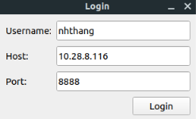
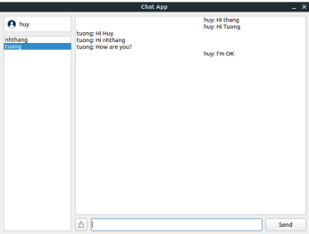
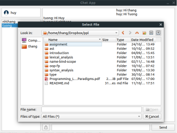
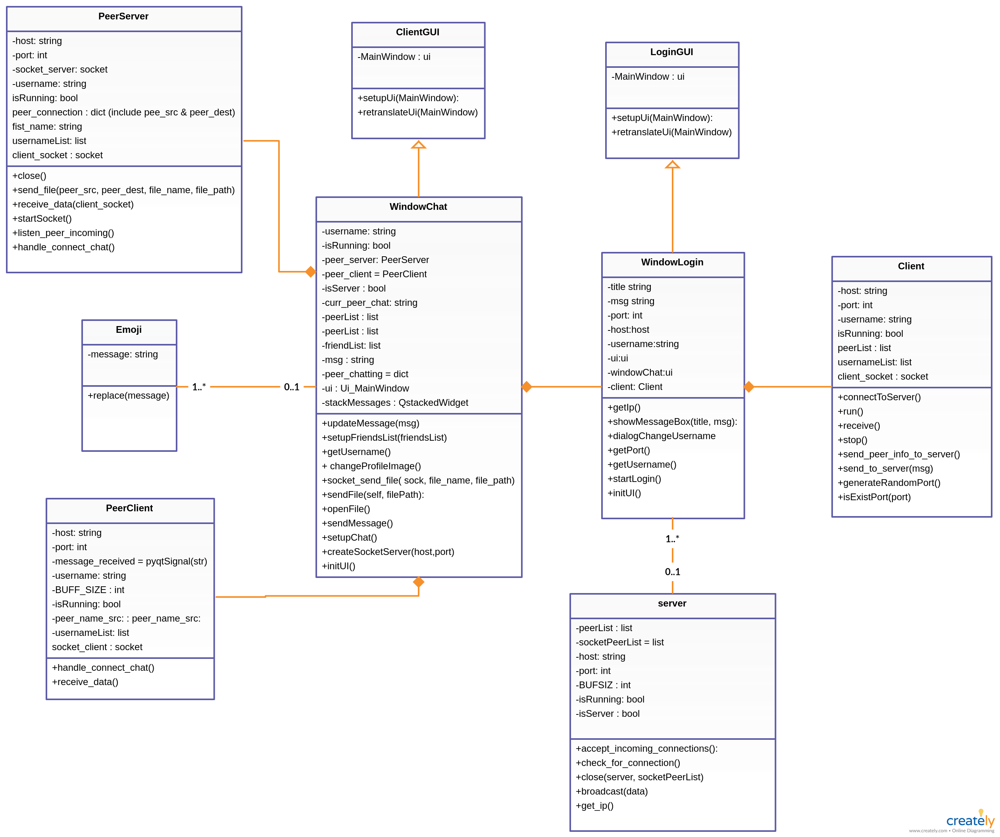
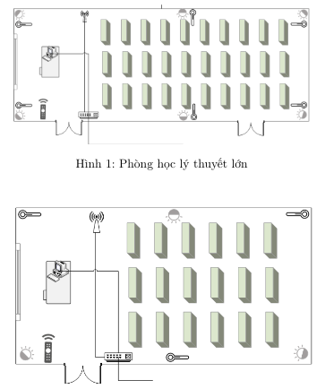
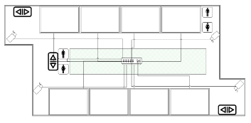
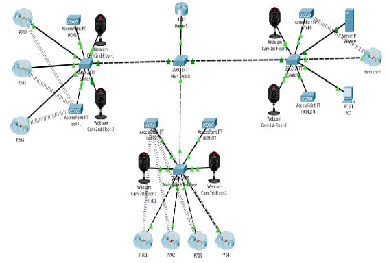
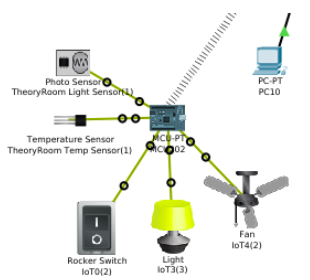
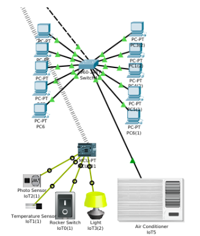
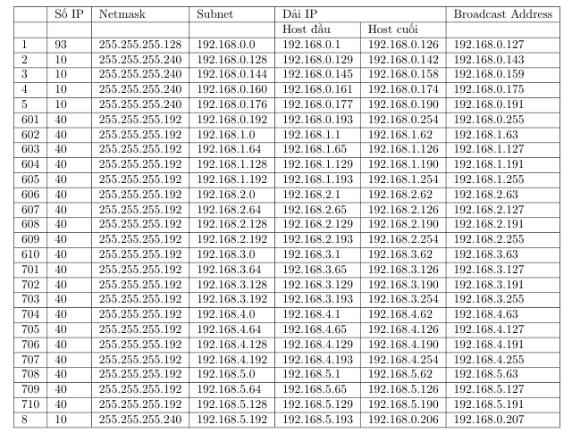

# Computer networks

## Documents
- All labs(DNS, ETH, HTTP, NAT, socket, SSL, TCP, UDP-IP,...)
- Related documents
- SSH presentation
- Full Slides

## Assignment
### Assignment 1
- Implement chat app via TCP protocol using Python with PyQt5 that can run on any platform.
- App features
    - Chat text
    - Icon
    - File transfer
- [Final report](ass/chat-app/report.pdf)

**Login GUI:**

**Main GUI:**

**File transfer GUI:**

**Class diagram:**

### Assignment 2
Design networks for an university.

**Physical design:**

**Logical design:**

**Subnet table:**

- [Final report](ass/report_CN_ASS2.pdf)

